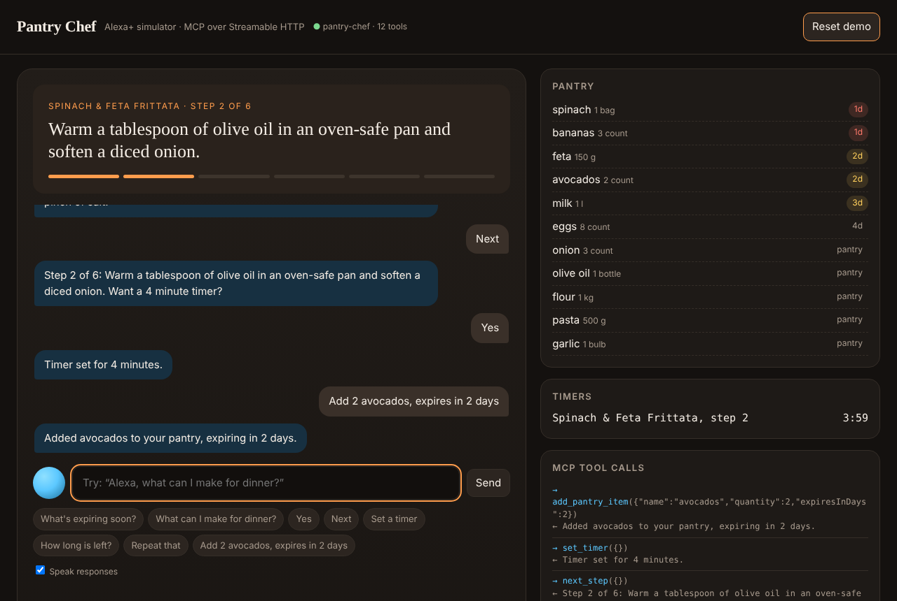

# 🍳 Pantry Chef: cook with what you have, hands-free

> An **Alexa+ MCP integration** for the *Build, Ship, Shape: Amazon Developer Hackathon* (Alexa+ track).

Pantry Chef knows what's in your kitchen and what's about to go bad. It suggests a dinner that uses those items up, then walks you through cooking it one spoken step at a time, with kitchen timers, so you never touch your phone with floury hands.

```
You:    Alexa, what can I make for dinner?
Alexa:  I'd make Spinach & Feta Frittata, which uses up your spinach and feta.
        It takes about 25 minutes. You have everything for it.
You:    Yes.
Alexa:  Let's make Spinach & Feta Frittata… Step 1 of 6: Heat the oven…
You:    Next.
Alexa:  Step 2 of 6: Soften a diced onion in olive oil. Want a 4 minute timer?
You:    Yes.
Alexa:  Timer set for 4 minutes.
```



## What's in the box

| Piece | Path | What it does |
| --- | --- | --- |
| **MCP server** | `src/server.ts` | 12 tools + 1 resource over **Streamable HTTP** (MCP spec 2025-11-25), built on the official TypeScript SDK |
| **Domain logic** | `src/domain.ts` | Pantry with expiry tracking, waste-aware recipe ranking, cooking sessions, timers |
| **Agent Skill** | `skills/pantry-chef/SKILL.md` | Teaches any agent *how* to use the tools in a voice-first way |
| **Alexa+ simulator** | `web/index.html` | Web app that talks to the server as a real MCP client, with voice in and out, a live tool-call log, pantry and timers |
| **Smoke test** | `test/smoke.ts` | Full end-to-end run using the official MCP client |

### Tools

`list_pantry` · `add_pantry_item` · `remove_pantry_item` · `whats_expiring` · `suggest_recipes` · `start_cooking` · `next_step` · `previous_step` · `repeat_step` · `set_timer` · `check_timers` · `cancel_timer`. There's also the resource `pantry://recipes`.

Every tool returns **two shapes**: `speech`, a sentence ready for voice devices, and `data`, structured output for screen devices like Echo Show. The simulator uses both.

## Quick start

```bash
npm install
npm start          # http://localhost:3000  (simulator)  ·  http://localhost:3000/mcp  (MCP endpoint)
npm test           # in a second terminal: end-to-end MCP smoke test
```

Requires Node 20+. For voice input, use Chrome or Edge and click the blue orb. Typing works everywhere.

### Use it from any MCP client

Point a Streamable HTTP client at `http://localhost:3000/mcp`. For example, run the MCP Inspector:

```bash
npx @modelcontextprotocol/inspector   # transport: Streamable HTTP, URL: http://localhost:3000/mcp
```

Each household's pantry is kept separate by the optional `x-household` header (the default is `demo`).

## Architecture

```
 ┌─────────────────────────┐   JSON-RPC over Streamable HTTP   ┌──────────────────────────┐
 │ Alexa+ (or simulator)   │ ────────── POST /mcp ───────────▶ │ Pantry Chef MCP server   │
 │ • speech in / out       │ ◀──── speech + structured data ── │ • 12 tools, 1 resource   │
 │ • intent → tool calls   │                                   │ • stateless transport    │
 │ • Agent Skill guidance  │                                   │ • per-household state    │
 └─────────────────────────┘                                   └──────────────────────────┘
```

* **Stateless transport.** Each POST gets a fresh server and transport. The cooking session and timers live in the domain layer, keyed by household. This makes it simple to deploy behind a load balancer, in a container, or on Lambda.
* **Waste-aware ranking.** A recipe's score is the share of its ingredients you already have, plus a bonus for each expiring item it uses.
* **Closing the loop.** Finishing a recipe takes the soon-to-expire ingredients it used off your pantry.

## Deploy

```bash
docker build -t pantry-chef . && docker run -p 3000:3000 pantry-chef
```

## Roadmap

* Recipe generation from any pantry with an LLM, and receipt or photo import of groceries
* Persistent storage, plus a shopping list for missing ingredients
* Proactive "your spinach expires tomorrow" morning nudges

## License

MIT
